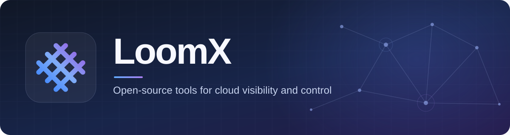

  

  We build open-source tools that help teams understand their cloud infrastructure and make informed changes.

  <a href="https://loomx.ai/">Website</a> ·
  <a href="https://loomx.ai/steward/">Product &amp; demo</a> ·
  <a href="https://loomx.ai/steward/docs/latest/en/">Documentation</a> ·
  <a href="https://loomx.ai/steward/docs/latest/zh/">中文文档</a>

## Meet Steward

[Steward](https://github.com/loomx-ai/steward) brings **AWS, Azure, Google Cloud, and Alibaba Cloud** into one interface. Go from a clear view of your resources to a reviewed cleanup with confidence.

- **Discover** what is running across your cloud accounts.
- **Understand** how resources connect and what a change could affect.
- **Review** cleanup impact before execution, then follow the results.

**Try it:** [Steward Cloud](https://steward.console.loomx.ai) · [Quick start](https://loomx.ai/steward/docs/latest/en/quick-start/) · [Self-hosting](https://loomx.ai/steward/docs/latest/en/installation/)

## Build with us

Steward is developed in the open. Explore the [source code](https://github.com/loomx-ai/steward), [report an issue](https://github.com/loomx-ai/steward/issues), or follow the [development guide](https://loomx.ai/steward/docs/latest/en/development/) to contribute.

Looking for a package? Use [Homebrew](https://github.com/loomx-ai/homebrew-tap) or the [APT and RPM repositories](https://github.com/loomx-ai/packages). See the [latest releases](https://github.com/loomx-ai/steward/releases) for what's new.

---

<a href="https://loomx.ai/about/">About LoomX</a> · <a href="https://loomx.ai/">loomx.ai</a>

